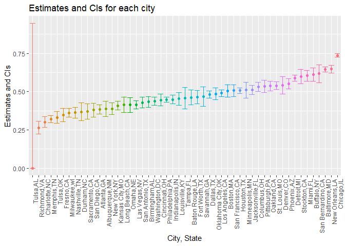

p8105\_hw5\_rh2916
================
Rui Huang
November 1, 2018

## Problem 1

### Start with a dataframe containing all file names

``` r
df = as.data.frame(list.files(path = "./data/data1"))
colnames(df) = "filename"
```

### Iterate over file names and tidy the result

``` r
read_data = function(subject) {
  
  read_csv(paste0("./data/data1/",subject))%>%
    janitor::clean_names() 
}

output = map_df(df[ ,1], read_data)

id = c(1:20)

df_problem1 = cbind(df, id, output) %>%
  mutate(filename = str_replace(filename, ".csv", ""))%>%
  separate(filename, into = c("arm", "subject_id"), sep = "_") %>%
  gather(key = week, value = observations, week_1:week_8) %>% 
  mutate(week = as.numeric(str_replace(week, "week_", "")),
         id = as.factor(id))
```

### Make a spaghetti plot

``` r
df_problem1 %>%
  ggplot(aes(x = week, y = observations, group = id, color = arm)) +
  geom_line() +
  theme(legend.position = "bottom")+
  labs(
    x = "week",
    y = "value"
  )+
  ggtitle("Observations on each subject over time")
```

<!-- -->

From the Spaghetti plot, we can find that the baseline for the two group
are similar, however, the observations for subjects in experimental
group increase over time while the observations for subjects in control
group keep stable over weeks.

## Problem 2

### Read data, add variable

``` r
df2_raw = read.csv("./data/homicide-data.csv") %>% 
  janitor::clean_names()

df_problem2 = 
  df2_raw %>%
  mutate(city_state = paste(city, state, sep = ",")) 
```

The raw data contains 12 variables and 52179 observations. The variables
contain information about the id, report date, victim demographic
character, city, state, location and disposition. The reported\_date,
lat and lon variables are numeric and the rest are factor variables.

### Summarize total number and unsolved number of homicides

``` r
df_summrize =
  df_problem2 %>% 
  group_by(city_state) %>% 
  summarize(total_homicide = n(),
            unsolved_homicide = sum(disposition == "Closed without arrest" | disposition == "Open/No arrest")) 

knitr::kable(df_summrize)
```

| city\_state       | total\_homicide | unsolved\_homicide |
| :---------------- | --------------: | -----------------: |
| Albuquerque,NM    |             378 |                146 |
| Atlanta,GA        |             973 |                373 |
| Baltimore,MD      |            2827 |               1825 |
| Baton Rouge,LA    |             424 |                196 |
| Birmingham,AL     |             800 |                347 |
| Boston,MA         |             614 |                310 |
| Buffalo,NY        |             521 |                319 |
| Charlotte,NC      |             687 |                206 |
| Chicago,IL        |            5535 |               4073 |
| Cincinnati,OH     |             694 |                309 |
| Columbus,OH       |            1084 |                575 |
| Dallas,TX         |            1567 |                754 |
| Denver,CO         |             312 |                169 |
| Detroit,MI        |            2519 |               1482 |
| Durham,NC         |             276 |                101 |
| Fort Worth,TX     |             549 |                255 |
| Fresno,CA         |             487 |                169 |
| Houston,TX        |            2942 |               1493 |
| Indianapolis,IN   |            1322 |                594 |
| Jacksonville,FL   |            1168 |                597 |
| Kansas City,MO    |            1190 |                486 |
| Las Vegas,NV      |            1381 |                572 |
| Long Beach,CA     |             378 |                156 |
| Los Angeles,CA    |            2257 |               1106 |
| Louisville,KY     |             576 |                261 |
| Memphis,TN        |            1514 |                483 |
| Miami,FL          |             744 |                450 |
| Milwaukee,wI      |            1115 |                403 |
| Minneapolis,MN    |             366 |                187 |
| Nashville,TN      |             767 |                278 |
| New Orleans,LA    |            1434 |                930 |
| New York,NY       |             627 |                243 |
| Oakland,CA        |             947 |                508 |
| Oklahoma City,OK  |             672 |                326 |
| Omaha,NE          |             409 |                169 |
| Philadelphia,PA   |            3037 |               1360 |
| Phoenix,AZ        |             914 |                504 |
| Pittsburgh,PA     |             631 |                337 |
| Richmond,VA       |             429 |                113 |
| Sacramento,CA     |             376 |                139 |
| San Antonio,TX    |             833 |                357 |
| San Bernardino,CA |             275 |                170 |
| San Diego,CA      |             461 |                175 |
| San Francisco,CA  |             663 |                336 |
| Savannah,GA       |             246 |                115 |
| St. Louis,MO      |            1677 |                905 |
| Stockton,CA       |             444 |                266 |
| Tampa,FL          |             208 |                 95 |
| Tulsa,AL          |               1 |                  0 |
| Tulsa,OK          |             583 |                193 |
| Washington,DC     |            1345 |                589 |

In the dataset, there are two city Tulsa in both AL and OK. In Tulsa,
AL, only one homicide and 0 unsolved homicide.

### Estimate the proportion of unsolved homicides in Baltimore, MD

``` r
Baltimore_homicide =
  df_problem2 %>% 
  filter(city_state == "Baltimore,MD") %>% 
  summarize(total_homicide = n()) 

df_baltimore <- df_summrize %>% 
  filter(city_state=='Baltimore,MD')

p.test <- prop.test(df_baltimore$unsolved_homicide,df_baltimore$total_homicide) 

broom::tidy(p.test)[,c(1,5,6)] %>% 
  knitr::kable()
```

|  estimate |  conf.low | conf.high |
| --------: | --------: | --------: |
| 0.6455607 | 0.6275625 | 0.6631599 |

### prop.test for each of the cities

``` r
prop_test = function(x, y) {
  prop.test(x, y) %>% 
  broom::tidy() %>%
  janitor::clean_names()
}

estimate = function(n){
  df_filter = df_summrize %>%
  filter(city_state == n)

map2_df( df_filter$unsolved_homicide,df_filter$total_homicide,  prop_test)  
}

df_city_state = df_summrize %>% pull(city_state)

df_proportion = map_df(df_city_state, estimate)

df_estimate = df_summrize %>%
  mutate(estimate_proportion =  map(df_city_state, estimate)) %>%
  unnest() %>% 
  mutate(city_state = forcats::fct_reorder(city_state,estimate))
```

### Create a plot that shows the estimates and CIs for each city

``` r
ggplot(df_estimate, aes(x = city_state, y = estimate, color = city_state)) +
  geom_point() +
  geom_errorbar(aes(x = city_state, ymin = conf_low, ymax = conf_high))+  
  labs(
    title = "Estimates and CIs for each city",
    x = "City, State",
    y = "Estimates and CIs"
  ) +
  theme(legend.position = "bottom", axis.text.x = element_text(angle = 90, hjust = 1), legend.key.width = unit(0.15,'cm')) +
  theme(legend.position = "none")
```

<!-- -->

From the plot, we can find that Chicago, New Orleans, Baltimore have top
three proportion of unsolved homicide. There is no unsolved case in
Tulsa, AL, so the CI is 0 to 1. There might be some error on collecting
data. When we exclude Tulsa, AL, Richmond has the lowest proportion of
unsolved homicide.
